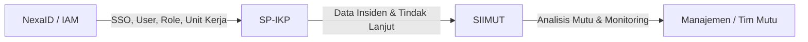
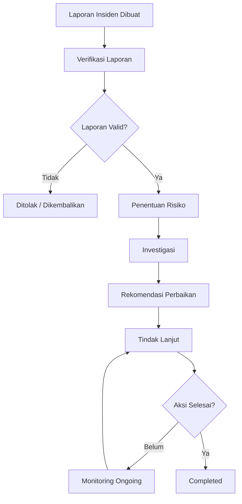
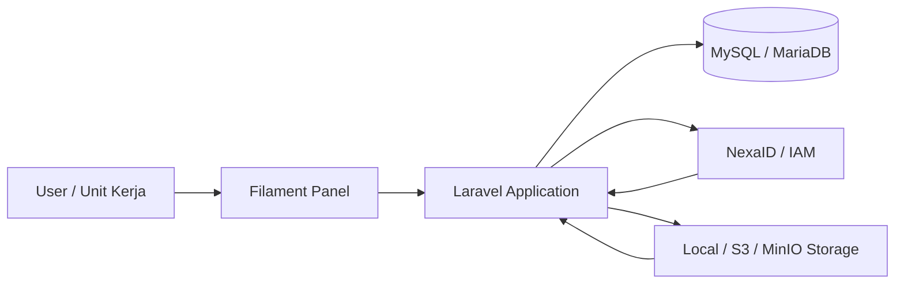
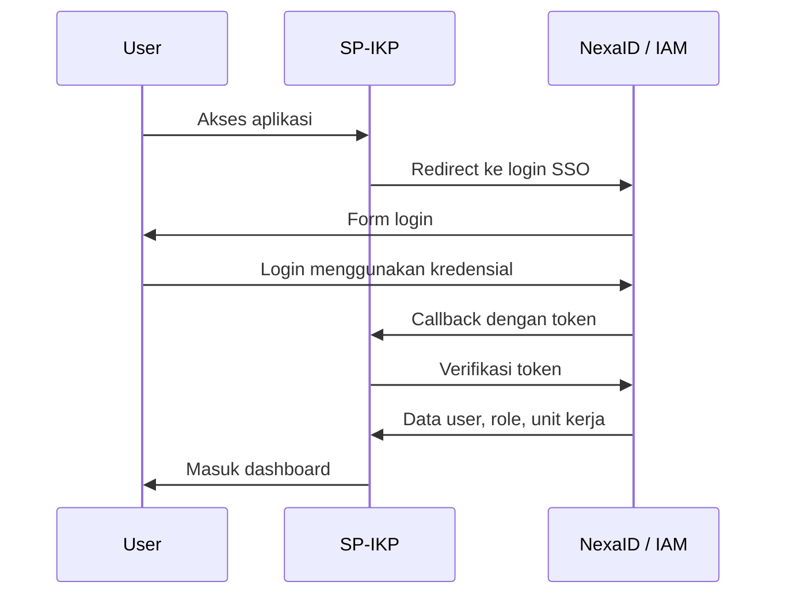

# SP-IKP — Sistem Pelaporan Insiden Keselamatan Pasien


**SP-IKP** adalah aplikasi manajemen pelaporan, investigasi, dan tindak lanjut **Insiden Keselamatan Pasien** berbasis workflow. Aplikasi ini dirancang untuk membantu rumah sakit mencatat kejadian insiden secara terstruktur, memproses laporan melalui tahapan verifikasi dan investigasi, serta memantau rekomendasi perbaikan sampai selesai.

SP-IKP merupakan bagian dari ekosistem digital **RSCH** bersama beberapa aplikasi lain seperti **SIIMUT** dan **NexaID / IAM**.

> SP-IKP bukan hanya aplikasi input laporan, tetapi sistem workflow untuk mengubah laporan insiden menjadi data tindak lanjut yang dapat digunakan dalam evaluasi mutu dan keselamatan pasien.

---

## Daftar Isi

* [Latar Belakang](#latar-belakang)
* [Tujuan Sistem](#tujuan-sistem)
* [Posisi dalam Ekosistem RSCH](#posisi-dalam-ekosistem-rsch)
* [Fitur Utama](#fitur-utama)
* [Workflow Insiden](#workflow-insiden)
* [Role dan Hak Akses](#role-dan-hak-akses)
* [Status Penanganan Insiden](#status-penanganan-insiden)
* [Arsitektur Sistem](#arsitektur-sistem)
* [Tech Stack](#tech-stack)
* [Struktur Direktori](#struktur-direktori)
* [Instalasi Development](#instalasi-development)
* [Konfigurasi Environment](#konfigurasi-environment)
* [Integrasi SSO NexaID / IAM](#integrasi-sso-nexaid--iam)
* [Database dan Migration](#database-dan-migration)
* [Testing Checklist](#testing-checklist)
* [Deployment Checklist](#deployment-checklist)
* [Roadmap](#roadmap)

---

## Latar Belakang

Insiden keselamatan pasien membutuhkan proses pencatatan dan tindak lanjut yang rapi agar tidak berhenti sebagai laporan administratif saja. Setiap kejadian perlu memiliki alur yang jelas mulai dari pelaporan awal, verifikasi, investigasi, rekomendasi, hingga aksi perbaikan.

Tanpa sistem yang terstruktur, beberapa masalah umum dapat terjadi:

* Laporan insiden tercecer atau tidak terdokumentasi dengan baik.
* Status penanganan sulit dipantau.
* Rekomendasi tidak memiliki tindak lanjut yang jelas.
* Unit terkait tidak memiliki visibilitas terhadap progres kasus.
* Data insiden sulit digunakan untuk evaluasi mutu jangka panjang.

SP-IKP dibangun untuk menjawab kebutuhan tersebut melalui pendekatan **workflow management**, sehingga setiap laporan memiliki status, penanggung jawab, proses, dan riwayat yang dapat ditelusuri.

---

## Tujuan Sistem

Tujuan utama SP-IKP adalah menyediakan sistem pelaporan insiden keselamatan pasien yang:

1. **Terstruktur**
   Setiap laporan mengikuti tahapan proses yang jelas dan terdokumentasi.

2. **Traceable**
   Riwayat perubahan status, verifikasi, investigasi, dan tindak lanjut dapat dilacak.

3. **Role-based**
   Akses pengguna disesuaikan berdasarkan role dan unit kerja.

4. **Terintegrasi**
   Menggunakan NexaID / IAM sebagai pusat autentikasi, role, dan unit kerja.

5. **Mendukung Evaluasi Mutu**
   Data insiden dapat menjadi konteks pendukung untuk analisis mutu di SIIMUT.

---

## Posisi dalam Ekosistem RSCH

SP-IKP berada di antara sistem autentikasi pusat dan sistem mutu rumah sakit.

| Aplikasi         | Fokus                                                                  | Peran terhadap SP-IKP                                  |
| ---------------- | ---------------------------------------------------------------------- | ------------------------------------------------------ |
| **NexaID / IAM** | SSO, user, role, unit kerja, access profile                            | Menyediakan autentikasi dan otorisasi pengguna         |
| **SP-IKP**       | Pelaporan insiden, verifikasi, investigasi, rekomendasi, tindak lanjut | Aplikasi utama pengelolaan insiden keselamatan pasien  |
| **SIIMUT**       | Indikator mutu, monitoring, compliance, laporan mutu                   | Menerima konteks dari data insiden untuk evaluasi mutu |

Diagram sederhana:



---

## Fitur Utama

### 1. Pelaporan Insiden

Modul ini digunakan untuk mencatat laporan awal insiden keselamatan pasien.

Data yang umumnya dicatat:

* Tanggal dan waktu kejadian.
* Unit kerja terkait.
* Jenis insiden.
* Kronologi kejadian.
* Lokasi kejadian.
* Pihak yang terlibat.
* Dampak awal.
* Pelapor.
* Lampiran pendukung jika diperlukan.

---

### 2. Verifikasi Laporan

Setelah laporan masuk, laporan dapat diverifikasi oleh petugas atau tim yang berwenang.

Proses verifikasi mencakup:

* Pemeriksaan kelengkapan data.
* Validasi kronologi.
* Penentuan apakah laporan dapat diproses lebih lanjut.
* Penentuan tingkat risiko awal.
* Pengubahan status laporan.

---

### 3. Investigasi Insiden

Modul investigasi digunakan untuk mendalami penyebab kejadian.

Investigasi dapat mencakup:

* Analisis penyebab langsung.
* Analisis akar masalah.
* Keterangan tambahan dari unit terkait.
* Pemeriksaan dokumen pendukung.
* Kesimpulan investigasi.
* Penentuan kebutuhan rekomendasi.

---

### 4. Rekomendasi Perbaikan

Setelah investigasi dilakukan, tim terkait dapat membuat rekomendasi perbaikan.

Contoh rekomendasi:

* Perbaikan SOP.
* Edukasi ulang petugas.
* Perubahan alur pelayanan.
* Peningkatan pengawasan.
* Perbaikan sarana atau sistem pendukung.
* Evaluasi ulang proses kerja unit.

---

### 5. Tindak Lanjut / Aksi

Rekomendasi yang telah dibuat perlu dipantau pelaksanaannya.

Modul tindak lanjut membantu memastikan bahwa rekomendasi tidak hanya berhenti sebagai catatan, tetapi benar-benar dieksekusi.

Data yang dapat dipantau:

* Penanggung jawab aksi.
* Deadline tindak lanjut.
* Status pengerjaan.
* Bukti pelaksanaan.
* Catatan evaluasi.
* Tanggal penyelesaian.

---

### 6. Monitoring Status

Setiap insiden memiliki status agar progres penanganan dapat dipantau.

Contoh status:

* `Pending`
* `Verified`
* `Under Investigation`
* `Action Required`
* `Ongoing`
* `Completed`
* `Rejected`

Status dapat disesuaikan dengan kebutuhan workflow aplikasi.

---

### 7. Dashboard dan Rekapitulasi

Dashboard digunakan untuk memberikan gambaran cepat terhadap kondisi pelaporan insiden.

Informasi yang dapat ditampilkan:

* Total laporan insiden.
* Insiden berdasarkan status.
* Insiden berdasarkan unit kerja.
* Insiden berdasarkan jenis kejadian.
* Insiden berdasarkan tingkat risiko.
* Kasus yang belum selesai.
* Tindak lanjut yang melewati deadline.

---

### 8. Export Laporan

SP-IKP dapat mendukung kebutuhan pelaporan melalui fitur export.

Format yang dapat digunakan:

* PDF
* Excel
* Rekap bulanan
* Rekap berdasarkan unit kerja
* Rekap berdasarkan status
* Rekap berdasarkan periode tertentu

---

## Workflow Insiden

Alur utama penanganan insiden:



Alur ini memastikan bahwa setiap laporan memiliki proses yang jelas dari awal sampai selesai.

---

## Role dan Hak Akses

Hak akses dalam SP-IKP dapat disesuaikan berdasarkan kebutuhan organisasi. Secara umum, pembagian role dapat dibuat seperti berikut:

| Role                | Deskripsi                                     | Akses Utama                                        |
| ------------------- | --------------------------------------------- | -------------------------------------------------- |
| **Super Admin**     | Pengelola sistem secara penuh                 | Semua modul, konfigurasi, user, role               |
| **Admin IKP**       | Pengelola utama aplikasi SP-IKP               | Kelola laporan, verifikasi, investigasi, dashboard |
| **Tim Mutu / KPRS** | Tim yang memantau mutu dan keselamatan pasien | Verifikasi, investigasi, rekomendasi, monitoring   |
| **Unit Kerja**      | Pengguna dari masing-masing unit              | Membuat laporan, melihat laporan unit terkait      |
| **Investigator**    | Petugas yang melakukan pendalaman kasus       | Mengisi hasil investigasi dan rekomendasi          |
| **Manajemen**       | Pihak pemantau tingkat manajerial             | Melihat dashboard, rekap, dan laporan akhir        |

---

## Status Penanganan Insiden

| Status                | Makna                                               |
| --------------------- | --------------------------------------------------- |
| `draft`               | Laporan baru dibuat dan belum dikirim oleh pelapor               |
| `dilaporkan`          | Laporan sudah dikirim oleh pelapor ke kepala unit   |
| `revisi`              | Laporan dikembalikan oleh kepala unit ke pelapor untuk perbaikan    |
| `diverifikasi`        | Laporan telah diverifikasi, grading, dan dianalisis awal oleh kepala unit  |
| `revisi_unit`         | Laporan dikembalikan oleh tim mutu ke kepala unit   |
| `investigasi`         | Laporan sedang dalam proses investigasi (Sederhana/RCA) oleh Tim Mutu  |
| `selesai`             | Seluruh proses investigasi & laporan telah selesai  |

---

## Arsitektur Sistem

SP-IKP menggunakan arsitektur aplikasi web berbasis Laravel dengan panel administrasi Filament.



Komponen utama:

* **Laravel App**
  Menangani business logic, workflow, validasi, autentikasi, dan integrasi.

* **Filament Panel**
  Menyediakan interface admin untuk pengelolaan laporan, investigasi, dan tindak lanjut.

* **MySQL / MariaDB**
  Menyimpan data utama aplikasi.

* **NexaID / IAM**
  Menyediakan autentikasi SSO, user, role, dan unit kerja.

* **Storage**
  Menyimpan file lampiran, dokumen pendukung, atau export laporan.

---

## Tech Stack

| Komponen         | Teknologi                              |
| ---------------- | -------------------------------------- |
| Backend          | Laravel                                |
| Admin Panel      | Filament PHP                           |
| Frontend Runtime | Blade / Livewire / Filament Components |
| Database         | MySQL / MariaDB                        |
| Authentication   | NexaID / IAM SSO                       |
| Authorization    | Role-based Access Control              |
| Queue            | Laravel Queue                          |
| Cache            | Laravel Cache                          |
| Storage          | Local / S3 / MinIO                     |
| Infrastructure   | Docker / Docker Compose                |
| Package Manager  | Composer, NPM                          |

---

## Struktur Direktori

Struktur umum aplikasi:

```txt
sp-ikp/
├── app/
│   ├── Filament/
│   │   ├── Resources/
│   │   ├── Pages/
│   │   └── Widgets/
│   ├── Models/
│   ├── Services/
│   ├── Policies/
│   └── Http/
│       ├── Controllers/
│       └── Middleware/
├── config/
│   ├── app.php
│   ├── auth.php
│   └── iam.php
├── database/
│   ├── migrations/
│   ├── seeders/
│   └── factories/
├── resources/
│   ├── views/
│   ├── css/
│   └── js/
├── routes/
│   ├── web.php
│   └── api.php
├── storage/
├── tests/
├── composer.json
├── package.json
└── README.md
```

---

## Instalasi Development

### 1. Clone Repository

```bash
git clone <url-repository-sp-ikp>
cd sp-ikp
```

### 2. Setup Environment

```bash
cp .env.example .env
```

Sesuaikan konfigurasi database, aplikasi, dan SSO di file `.env`.

### 3. Install Dependency Backend

```bash
composer install
```

### 4. Install Dependency Frontend

```bash
npm install
```

Untuk development:

```bash
npm run dev
```

Untuk production build:

```bash
npm run build
```

### 5. Generate Application Key

```bash
php artisan key:generate
```

### 6. Jalankan Migration dan Seeder

```bash
php artisan migrate --seed
```

### 7. Jalankan Aplikasi

Menggunakan local server:

```bash
php artisan serve
```

Atau menggunakan Docker:

```bash
docker compose up -d
```

---

## Konfigurasi Environment

Contoh konfigurasi minimal:

```env
APP_NAME="SP-IKP"
APP_ENV=local
APP_KEY=
APP_DEBUG=true
APP_URL=http://localhost:8200

DB_CONNECTION=mysql
DB_HOST=127.0.0.1
DB_PORT=3306
DB_DATABASE=sp_ikp
DB_USERNAME=root
DB_PASSWORD=

SESSION_DRIVER=database
QUEUE_CONNECTION=database
CACHE_STORE=database

USE_SSO=true
IAM_ENABLED=true
IAM_HOST=http://127.0.0.1:8010
IAM_BASE_URL=${IAM_HOST}
IAM_BACKCHANNEL=http://127.0.0.1:8010
IAM_APP_KEY=sp-ikp-services

IAM_LOGIN_ROUTE=/sso/login
IAM_CALLBACK_ROUTE=/sso/callback
IAM_DEFAULT_REDIRECT=/

IAM_GUARD=web
IAM_USER_MODEL=App\Models\User
IAM_IDENTIFIER_FIELD=nip

IAM_SYNC_ROLES=true
IAM_ROLE_GUARD_NAME=web
IAM_REQUIRE_ROLES=true
IAM_ALLOW_ROLELESS_SSO=false

IAM_STORE_TOKEN_IN_SESSION=true
IAM_VERIFY_EACH_REQUEST=true
IAM_VERIFY_REMOTE_EACH_REQUEST=true
IAM_ATTACH_VERIFY_MIDDLEWARE=true
```

---

## Integrasi SSO NexaID / IAM

SP-IKP menggunakan NexaID / IAM sebagai pusat autentikasi dan otorisasi.

Fungsi IAM:

* Login terpusat melalui SSO.
* Sinkronisasi data user.
* Sinkronisasi role.
* Sinkronisasi unit kerja.
* Validasi token.
* Pengelolaan akses aplikasi.

Alur login:



---

## Database dan Migration

Aplikasi menggunakan migration Laravel untuk mengelola struktur database.

Command umum:

```bash
php artisan migrate
php artisan migrate:fresh --seed
php artisan migrate:status
```

Untuk production, gunakan migration normal:

```bash
php artisan migrate --force
```

Hindari menjalankan `migrate:fresh` di production karena akan menghapus seluruh data.

---

## Queue dan Background Job

Jika aplikasi menggunakan queue untuk export laporan, notifikasi, atau proses sinkronisasi, jalankan worker:

```bash
php artisan queue:work
```

Untuk production, queue worker sebaiknya dijalankan menggunakan Supervisor atau container worker terpisah.

Contoh konfigurasi `.env`:

```env
QUEUE_CONNECTION=database
```

Pastikan tabel queue tersedia:

```bash
php artisan queue:table
php artisan migrate
```

---

## Storage dan Lampiran

SP-IKP dapat menyimpan file lampiran atau dokumen pendukung menggunakan local storage atau S3-compatible storage seperti MinIO.

Command untuk membuat symbolic link:

```bash
php artisan storage:link
```

Contoh konfigurasi S3 / MinIO:

```env
FILESYSTEM_DISK=local

AWS_ACCESS_KEY_ID=
AWS_SECRET_ACCESS_KEY=
AWS_DEFAULT_REGION=us-east-1
AWS_BUCKET=
AWS_URL=
AWS_ENDPOINT=
AWS_USE_PATH_STYLE_ENDPOINT=true
```

---

## Testing Checklist

Gunakan checklist berikut setelah melakukan perubahan fitur atau deployment.

### Authentication

* [ ] User dapat login melalui NexaID / IAM.
* [ ] Callback SSO berhasil diproses.
* [ ] Token berhasil diverifikasi.
* [ ] Session tidak aktif setelah token expired.
* [ ] Logout berjalan normal.

### User & Role

* [ ] Data user tersinkron dari IAM.
* [ ] Role user tersinkron dengan benar.
* [ ] Hak akses sesuai role.
* [ ] User tanpa role tidak dapat mengakses modul yang dibatasi.
* [ ] Unit kerja user terbaca dengan benar.

### Laporan Insiden

* [ ] User dapat membuat laporan insiden.
* [ ] Validasi form berjalan.
* [ ] Data unit kerja tersimpan.
* [ ] Lampiran dapat diunggah jika fitur tersedia.
* [ ] Laporan masuk ke status awal yang benar.

### Workflow

* [ ] Laporan dapat diverifikasi.
* [ ] Laporan dapat ditolak atau dikembalikan.
* [ ] Investigasi dapat diisi.
* [ ] Rekomendasi dapat dibuat.
* [ ] Tindak lanjut dapat dipantau.
* [ ] Status berubah sesuai alur.

### Dashboard & Export

* [ ] Dashboard menampilkan data sesuai filter.
* [ ] Rekap berdasarkan periode berjalan.
* [ ] Export PDF berjalan.
* [ ] Export Excel berjalan.
* [ ] Data export sesuai data di aplikasi.

---

## Deployment Checklist

Sebelum deploy ke production, pastikan:

* [ ] `APP_ENV=production`
* [ ] `APP_DEBUG=false`
* [ ] `APP_KEY` sudah terisi.
* [ ] `APP_URL` sesuai domain aplikasi.
* [ ] Konfigurasi database production sudah benar.
* [ ] Konfigurasi IAM production sudah benar.
* [ ] Migration sudah diuji di staging.
* [ ] Storage sudah dikonfigurasi.
* [ ] Queue worker aktif jika digunakan.
* [ ] Scheduler aktif jika digunakan.
* [ ] Permission folder `storage` dan `bootstrap/cache` sudah benar.
* [ ] Log tidak dalam mode debug berlebihan.
* [ ] Backup database tersedia.
* [ ] Monitoring error/log tersedia.

Command umum production:

```bash
composer install --no-dev --optimize-autoloader
npm ci
npm run build

php artisan migrate --force
php artisan config:cache
php artisan route:cache
php artisan view:cache
php artisan event:cache
```

---

## Command Artisan yang Sering Digunakan

```bash
# Generate key
php artisan key:generate

# Migration
php artisan migrate
php artisan migrate:status
php artisan migrate --force

# Seeder
php artisan db:seed

# Clear cache
php artisan optimize:clear

# Build cache production
php artisan config:cache
php artisan route:cache
php artisan view:cache

# Queue
php artisan queue:work

# Storage
php artisan storage:link
```

---

## Prinsip Desain Sistem

SP-IKP dikembangkan dengan beberapa prinsip utama:

1. **Workflow-first**
   Setiap data insiden harus memiliki alur, status, dan proses yang jelas.

2. **Audit-friendly**
   Data penting sebaiknya mudah ditelusuri untuk kebutuhan evaluasi dan pemeriksaan.

3. **Role-aware**
   Tampilan dan akses sistem mengikuti peran pengguna.

4. **Unit-based Access**
   Data dapat dibatasi berdasarkan unit kerja pengguna.

5. **Integration-ready**
   Sistem disiapkan untuk terhubung dengan IAM dan aplikasi mutu lainnya.

6. **Operational Simplicity**
   Fitur dibuat agar mudah digunakan oleh pengguna non-teknis di lingkungan rumah sakit.

---

## Potensi Integrasi dengan SIIMUT

SP-IKP dapat menjadi sumber konteks untuk analisis indikator mutu di SIIMUT.

Contoh:

| Data SP-IKP                          | Potensi Insight di SIIMUT                      |
| ------------------------------------ | ---------------------------------------------- |
| Insiden jatuh pasien                 | Konteks penurunan indikator keselamatan pasien |
| Keterlambatan tindak lanjut          | Evaluasi kepatuhan unit terhadap rekomendasi   |
| Peningkatan insiden di unit tertentu | Sinyal kebutuhan audit atau edukasi ulang      |
| Jenis insiden dominan                | Dasar prioritas program peningkatan mutu       |

Integrasi ini memungkinkan data insiden tidak hanya menjadi arsip, tetapi juga menjadi bahan evaluasi strategis.

---

## Roadmap

Beberapa pengembangan yang dapat dilakukan ke depan:

* [ ] Pemisahan Entity Antara Insiden dan Investigasi.
* [ ] Reminder tindak lanjut otomatis.
* [ ] Notifikasi email atau WhatsApp internal.
* [ ] Export laporan KPRS.
* [ ] Integrasi insight ke SIIMUT.
* [ ] API internal untuk rekap data insiden.
* [ ] SLA monitoring untuk tindak lanjut.

---

## Catatan Pengembangan

Beberapa hal yang perlu diperhatikan saat mengembangkan fitur baru:

* Jangan mengubah alur status tanpa mempertimbangkan efek ke laporan dan dashboard.
* Pastikan setiap perubahan akses diuji dengan beberapa role berbeda.
* Hindari hardcode unit kerja atau role.
* Gunakan konfigurasi IAM untuk mapping user, role, dan unit kerja.
* Pastikan export laporan mengikuti data hasil filter.
* Validasi input penting terutama pada laporan, investigasi, dan tindak lanjut.
* Gunakan migration untuk semua perubahan struktur database.

---

## Kontribusi

Untuk kontribusi internal:

1. Buat branch baru dari branch utama.
2. Gunakan nama branch yang jelas.

```bash
git checkout -b feature/nama-fitur
```

3. Jalankan migration dan testing lokal.
4. Pastikan tidak ada file sensitif seperti `.env` yang ikut ter-commit.
5. Buat Pull Request dengan deskripsi perubahan yang jelas.
6. Sertakan cara pengujian pada deskripsi Pull Request.

Contoh format branch:

```txt
feature/dashboard-insiden
fix/sso-unit-kerja-sync
refactor/workflow-status
hotfix/export-pdf
```

---

## License

Aplikasi ini dikembangkan untuk kebutuhan internal ekosistem RSCH.

Penggunaan, distribusi, dan modifikasi mengikuti kebijakan internal pemilik sistem.

---

## Penutup

SP-IKP dikembangkan untuk membantu proses pengelolaan insiden keselamatan pasien secara lebih rapi, terukur, dan mudah dipantau. Dengan pendekatan workflow, integrasi IAM/SSO, serta potensi koneksi dengan SIIMUT, aplikasi ini diharapkan dapat mendukung peningkatan mutu layanan dan keselamatan pasien secara berkelanjutan.
