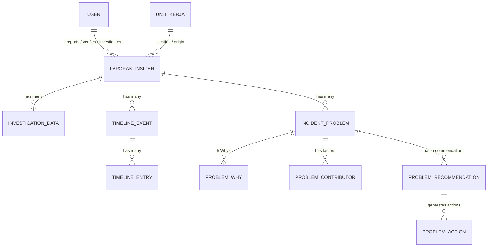

# Struktur dan Arsitektur SP-IKP

Dokumen ini menjelaskan struktur data dan relasi model yang digunakan di dalam aplikasi **SP-IKP** (Sistem Pelaporan Insiden Keselamatan Pasien). Struktur ini dibangun berdasarkan prinsip *workflow* yang dapat melacak setiap insiden mulai dari pelaporan hingga analisis akar masalah (RCA).

---

## 1. Core Model (Laporan Insiden)

**`LaporanInsiden`** adalah entitas utama di aplikasi ini. Model ini menyimpan data dasar insiden dan memegang status *workflow* secara keseluruhan.

**Kolom Utama Laporan Insiden:**
- Data Pelapor & Pasien (Unit Kerja, Nama Pasien, Rekam Medis, dll)
- Data Kejadian (Tanggal, Waktu, Lokasi, Jenis Insiden)
- Grading & Risiko (Warna grading, dampak, dll)
- Workflow User & Timestamps (reported_by, verified_by, investigation_started_by, dll)
- Status Workflow (`draft`, `dilaporkan`, `revisi`, `diverifikasi`, `revisi_unit`, `investigasi`, `selesai`)

---

## 2. Investigasi Sederhana

Untuk insiden dengan risiko rendah/menengah, tim mutu melakukan investigasi sederhana menggunakan model **`InvestigationData`**.

Model ini menyimpan data pendalaman yang dikategorikan berdasarkan:
1. `interview` (Wawancara pihak terkait)
2. `review_dokumen` (Tinjauan rekam medis / SOP)
3. `observasi` (Observasi lapangan)

Setiap investigasi dapat memiliki lampiran bukti/dokumen yang dikelola menggunakan *Spatie Media Library*.

---

## 3. Root Cause Analysis (RCA) - `Problem*` Models

Untuk insiden dengan risiko tinggi (Sentinel/Merah), dilakukan analisis mendalam yang direpresentasikan oleh *group* model `Problem`:

- **`IncidentProblem`**: Merupakan *problem statement* / masalah utama dari sebuah insiden.
- **`ProblemWhy`**: Implementasi metode *5-Whys* untuk mencari akar masalah dari sebuah `IncidentProblem`.
- **`ProblemContributor`**, **`ProblemContributorCategory`**, **`ProblemContributorComponent`**, **`ProblemContributorSubComponent`**, **`ProblemContributorDescription`**: Model-model ini digunakan untuk memetakan faktor kontributor (seperti *Fishbone Diagram* / faktor manusia, lingkungan, sistem, dll).
- **`ProblemRecommendation`**: Rekomendasi perbaikan yang lahir dari masalah/akar masalah yang telah diidentifikasi.
- **`ProblemAction`**: Tindak lanjut spesifik / *Action Plan* yang dilakukan berdasarkan rekomendasi.

---

## 4. Kronologi Kejadian - `Timeline*` Models

Untuk merangkai waktu terjadinya insiden dan tindakan yang dilakukan, sistem mencatatnya di dalam modul Timeline:

- **`TimelineEvent`**: Mengelompokkan kejadian/event kronologis pada suatu laporan insiden.
- **`TimelineEntry`**: Rincian entri waktu (jam/menit) dan deskripsi kejadian.
- **`TimelineCategory`**: Kategori untuk setiap event (misal: Pra-insiden, Insiden, Pasca-insiden).

---

## 5. Master Data & Integrasi

- **`UnitKerja`**: Master data unit kerja di rumah sakit, disinkronisasi dengan IAM.
- **`User`**: Master data pengguna sistem, terintegrasi Single Sign-On (SSO) dari NexaID / IAM.

---

## 6. Diagram Relasi Sederhana

Struktur ini memastikan sistem tidak hanya menjadi aplikasi *CRUD* (Create, Read, Update, Delete) biasa, melainkan platform **Investigasi Keselamatan Pasien** yang komprehensif, mulai dari *Grading* Risiko hingga penentuan *Action Plan*.
